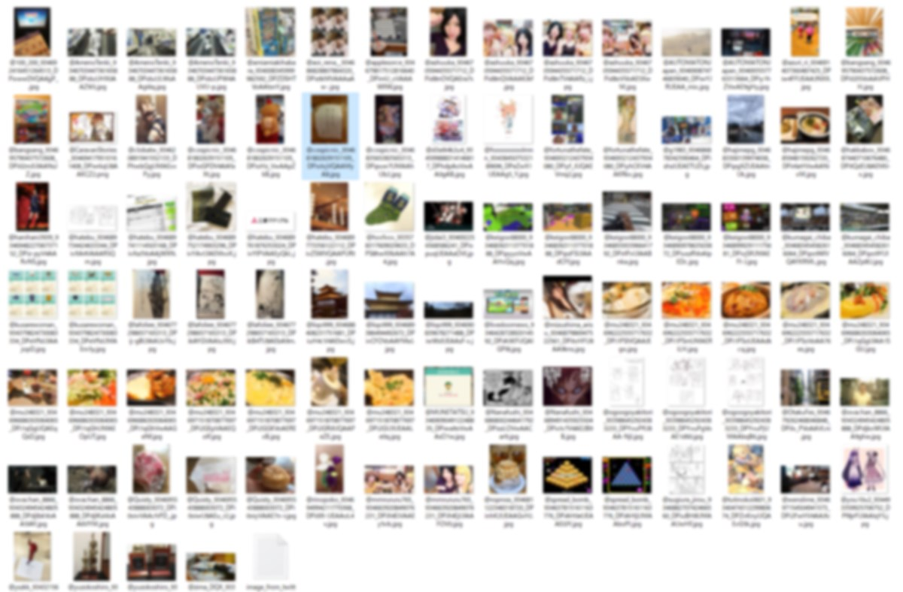
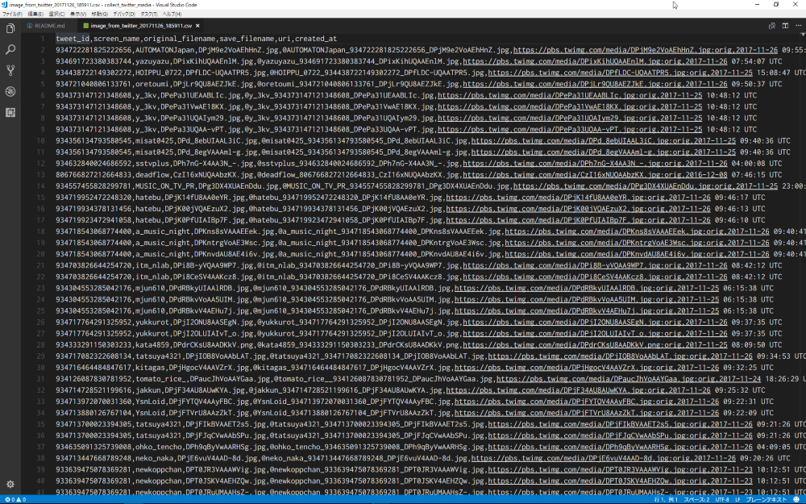

[](https://circleci.com/gh/corselia/collect_twitter_media/tree/master) [](https://codecov.io/gh/corselia/collect_twitter_media) [](https://coveralls.io/github/corselia/collect_twitter_media)

# Overview
- You can collect media file (sorry, now image files only except for gif and mp4)
- The source account is yourself (the media file is collected from your home timeline)

# Required
- `wget` command

# Installation
```ruby
$ gem install collect_twitter_media
```

# Usage

#### 1. require gem
```ruby
require 'collect_twitter_media'
```

#### 2. set your Twitter API token
- set the Twitter API token

```ruby
CollectTwitterMedia.consumer_key('YOUR_CONSUMER_KEY')
CollectTwitterMedia.consumer_secret('YOUR_CONSUMER_SECRET')
CollectTwitterMedia.access_token('YOUR_ACCESS_TOKEN')
CollectTwitterMedia.access_token_secret('YOUR_ACCESS_TOKEN_SECRET')
```

#### 3. 🎉exec `save` method🎉
- the first argv is the directory name to collect

```ruby
CollectTwitterMedia.save('media_collection')
```

#### 4. 🎆you have collected the media files and the csv file!🎆
- in the directory you specified, the media files have collected
    - the format of filename has 3 parts
        - `@twitter_screen_name`
        - `tweet_id`
        - `media_id`
    - the example of filename
        - `@dhh_934687159870177697_dPi3GGKVoAERExB.jpg`
        - `@tenderlove_924694994511770368_IPi5IX-UEAAoL4v.jpg`
- in the directory you specified, the csv file has created
    - the columns of this csv file
        - `tweet_id`
        - `screen_name`
        - `original_filename`
        - `save_filename`
        - `uri`
        - `created_at`
    - the filename of this csv file has 2 parts
        - `image_from_twitter`
        - `%Y%m%d_%H%M%S`
    - the example of filename
        - `image_from_twitter_20171126_171717.csv`
        - `image_from_twitter_20171224_210000.csv`

# Screenshot
- the directory which contains the media files and the csv file


- the csv file


# Options
- the `save` method can take 4 argvs
    - the first:  the directory name to collect [required]
    - the second: the collect count of tweet per loop (default: 200) [optional]
    - the third:  the loop count to collect media (default: 1) [optional]
        - Be careful about `API Rate limits`
    - the fourth: the starting tweet id to collect media (default: the latest) [optional]

# Note
- Please, please be careful about `API Rate limits`
    - [Rate limits — Twitter Developers](https://developer.twitter.com/en/docs/basics/rate-limits)
    - [GET statuses/home\_timeline — Twitter Developers](https://developer.twitter.com/en/docs/tweets/timelines/api-reference/get-statuses-home_timeline)

## Development
After checking out the repo, run `bin/setup` to install dependencies. Then, run `rake spec` to run the tests. You can also run `bin/console` for an interactive prompt that will allow you to experiment.

To install this gem onto your local machine, run `bundle exec rake install`. To release a new version, update the version number in `version.rb`, and then run `bundle exec rake release`, which will create a git tag for the version, push git commits and tags, and push the `.gem` file to [rubygems.org](https://rubygems.org).

## Contributing
Bug reports and pull requests are welcome on GitHub at https://github.com/[USERNAME]/collect_twitter_media.

## License
The gem is available as open source under the terms of the [MIT License](https://opensource.org/licenses/MIT).

## History

#### 2017-11-26
- Version 1.1.0
    - add `created_at` column to the output CSV file

#### 2017-11-26
- Version 1.0.0
    - first release
